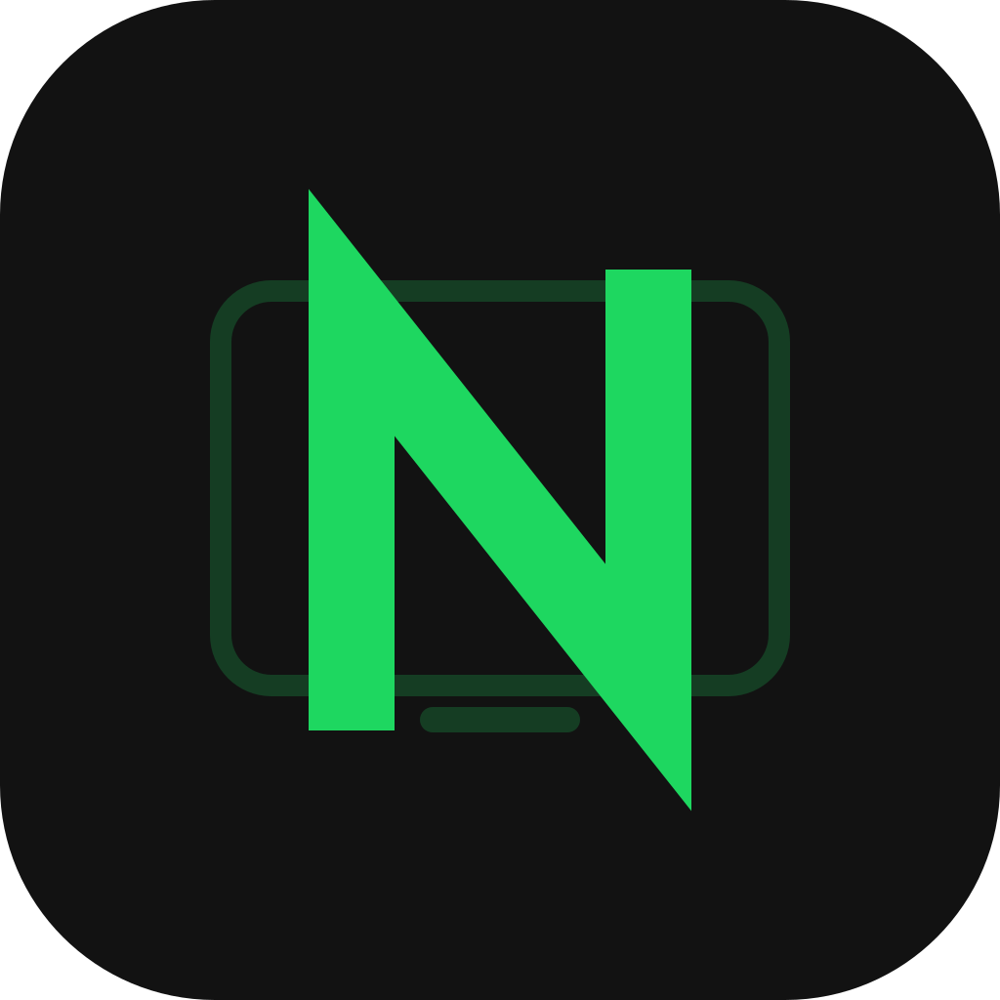

<div align="center">



# NeoDesk

**A RustDesk Android client with a UI redesigned to my taste.**

</div>

## About

NeoDesk is an Android remote-desktop client built on RustDesk's engine, with a
reworked user interface. It keeps RustDesk's speed and protocol and changes only
the client UI. I built it to have a client interface tailored to my own
preferences.

> Control end only (Android). The device being controlled still runs regular
> RustDesk / a RustDesk-compatible host.

## Download

Grab the latest `neodesk-*.apk` from the
[Releases](https://github.com/Kobayashi2003/NeoDesk/releases) page and install it
on an arm64 Android device.

## Build

Requires Flutter 3.24.5 on `PATH` (or `$env:FLUTTER_HOME` set). The prebuilt
engine (`librustdesk.so`) is vendored, so no Rust toolchain is needed.

```powershell
.\scripts\build.ps1               # analyze + test, then release build -> dist\neodesk-<version>.apk
.\scripts\build.ps1 debug         # debug build
.\scripts\build.ps1 -SkipTests    # skip tests, just build
```

Or build directly without the script:

```powershell
cd rustdesk
flutter build apk --release --target-platform android-arm64
```

## What I wrote

The entire redesigned UI and gesture/interaction system (`neodesk_core/`), plus a
thin adapter and launcher (`rustdesk/lib/neodesk/`) that bind it to RustDesk's
engine. Everything else is RustDesk's vendored client and prebuilt engine.

## Thanks

Built on [RustDesk](https://github.com/rustdesk/rustdesk) — huge thanks to the
RustDesk project, whose engine and client this is based on.
